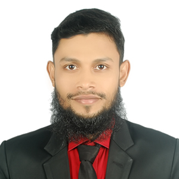

Sabbir Ahamed  
I am Frontend Developer.  

---

# About me.

 Assalamu Alaikum,
I'm Sabbir Ahamed. I'm from Tongi,Gazipur. I've completed my SSC Noagoan M.A Majid Miah High School and I've completed my HSC Milestone College. Now I'm studying in CSE department at Daffodil International University. I am in 8th semester. My current CGPA is average. 

My hobbies are singing, Reading,Improve my skills,volunteering and traveling,photography.

My strengths are I'm a Good team spirit ,self-motivated, hard-working, disciplined person. (I have experience. I have led various events. And leading Mind Fresh Travelling).I like to learn new things and acquire as much knowledge as possible.

I can speak good Bengali and English.

My personal skills. C Programming, Java Language, SQL Query, HTML, and Android Development.

My short-term goal is to get a job in a reputable company and my long-term goal is to create my own company.

_I believe, my work is my identity._  

__Thank you.__

;

`Hi it's me.`

[youtube](https://youtu.be/3k8Bq_usPsk)

### image  

### table
name| Email | Number  
---- ------- ------- 